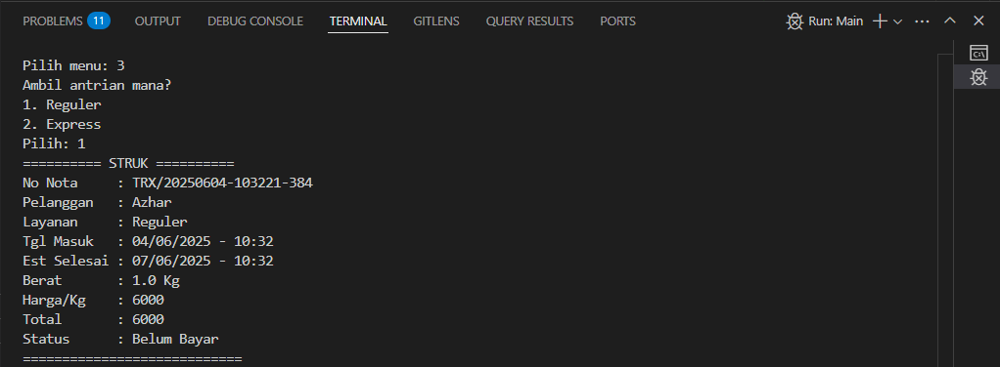

# Syntax_Squad-PP1-B-2025

### Dibuat Untuk Memenuhi Tugas Besar Mata Kuliah Praktikum Pemograman 1

## Dokumentasi Penggunaan

1. **Jalankan Program**

   - Compile semua file `.java`:
     ```
     javac *.java
     ```
   - Jalankan program:
     ```
     java Main
     ```

2. **Menu Utama**

   - Setelah program berjalan, akan muncul menu:
     ```
     ===== SISTEM ANTRIAN LAUNDRY =====
     1. Tambah Antrian
     2. Lihat Semua Antrian
     3. Ambil Antrian (Dequeue)
     4. Simpan Antrian ke File
     5. Keluar
     Pilih menu:
     ```

3. **Tambah Antrian**

   - Pilih menu 1, masukkan nama pelanggan, berat laundry, dan jenis layanan (Reguler/Express).
   - Data antrian akan masuk ke sistem (belum otomatis tersimpan ke file).

4. **Lihat Antrian**

   - Pilih menu 2, lalu pilih ingin melihat antrian Reguler atau Express.
   - Daftar antrian sesuai layanan akan ditampilkan.

5. **Ambil Antrian (Dequeue)**

   - Pilih menu 3, lalu pilih layanan yang ingin diambil antriannya.
   - Antrian terdepan layanan tersebut akan dihapus dari daftar dan dipindahkan ke file catatan.

6. **Simpan Antrian ke File**

   - Pilih menu 4 untuk menyimpan seluruh antrian yang ada ke file (`antrian-reguler.txt` dan `antrian-express.txt`).
   - File akan di-overwrite dengan data terbaru.

7. **Keluar**
   - Pilih menu 5 untuk keluar dari program.

---

## Summary / Kesimpulan Fitur

- **Tambah Antrian:** Menambah data pelanggan ke antrian sesuai layanan.
- **Lihat Antrian:** Melihat daftar antrian berdasarkan layanan (Reguler/Express).
- **Ambil Antrian:** Mengambil (menghapus) antrian terdepan sesuai layanan dan memindahkan ke catatan/history.
- **Simpan ke File:** Menyimpan seluruh antrian ke file, file akan di-overwrite agar tidak terjadi duplikasi.
- **Catatan:** Setiap antrian yang diambil akan dicatat di `catatan.txt` sebagai history.
- **Dukungan File Kosong:** Program tetap berjalan walau file antrian belum ada.
- **Antarmuka Menu Interaktif:** Pengguna memilih fitur melalui menu yang jelas.

---

## Dokumentasi Eksekusi



---
